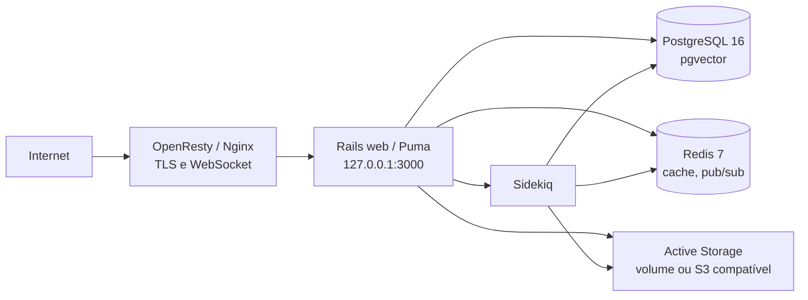

# Arquitetura de infraestrutura

## Visão completa



O proxy público termina TLS, aplica limites de corpo e encaminha WebSocket para
o Rails. PostgreSQL e Redis não publicam portas na Internet. O único endpoint
exposto pelo host é o Rails em `127.0.0.1:3000`, destinado ao proxy local.

## Componentes

| Camada | Componente | Responsabilidade | Persistência |
|---|---|---|---|
| Borda | OpenResty/Nginx | TLS, proxy, WebSocket, cabeçalhos e limite de upload | configuração fora do clone + exemplo em `infra/proxy/` |
| Web | Rails/Puma | UI, API, autenticação, webhooks e healthcheck `/health` | stateless; logs e Active Storage são externos |
| Assíncrona | Sidekiq | processamento de jobs, emails, automações e integrações | fila em Redis; estado final no PostgreSQL |
| Banco | PostgreSQL 16 + pgvector | contas, contatos, conversas, mensagens, configurações e embeddings | `runtime/data/postgres` local; volume dedicado em produção |
| Cache/fila | Redis 7 | cache, pub/sub e backend de jobs | `runtime/data/redis` local; volume dedicado em produção |
| Arquivos | Active Storage | anexos e uploads | `runtime/data/storage` local; S3 compatível ou volume dedicado em produção |
| Desenvolvimento | Vite + MailHog | hot reload e captura local de email | temporário |
| Governança | GitHub Actions | validação do contrato de Compose e separação de dados privados | artefatos do CI |

## Ambientes

### Desenvolvimento local

O contrato próprio está em `infra/compose/docker-compose.local.yaml`. Ele
constrói o app a partir do clone, mantém os dados fora do Git e roda Rails,
Sidekiq, Vite, PostgreSQL, Redis e MailHog. O Compose oficial na raiz é mantido
como referência upstream, mas não deve ser misturado com o Compose próprio na
mesma porta.

### Produção

`infra/compose/docker-compose.production.yaml` executa uma imagem imutável
definida por `CHATWOOT_IMAGE`. O arquivo de ambiente real é externo ao clone.
Rails e Sidekiq compartilham a mesma imagem e configuração; PostgreSQL e Redis
ficam em rede privada sem `ports:`. O proxy público fica fora do Compose,
conforme o exemplo em `infra/proxy/openresty.conf.example`.

Topologia de host:

```text
Internet -> OpenResty/Nginx :443
         -> 127.0.0.1:3000
         -> Rails web :3000
         -> rede Docker privada
            ├── PostgreSQL :5432
            └── Redis :6379
```

## Banco e recuperação

O banco oficial é PostgreSQL 16 com `pgvector`, nome padrão
`chatwoot_production` em produção e `chatwoot_dev` em desenvolvimento. O
diretório de dados vivo não é backup: backups SQL e seus checksums ficam em
`private/recovery/database/` localmente e em armazenamento privado equivalente
no host de produção.

Antes de qualquer migration de produção:

1. verificar o SHA da imagem e a lista de migrations;
2. criar dump consistente com checksum;
3. testar restauração em ambiente isolado quando for uma mudança de risco;
4. aplicar migration por janela autorizada;
5. validar `/health`, jobs e uma operação funcional;
6. registrar SHA, backup, resultado e rollback em `docs/operations/`.

Rollback de aplicação troca somente a imagem quando o schema continuar
compatível. Rollback de schema exige procedimento separado e backup validado.

## Não objetivos da primeira fase

- Kubernetes ou cluster distribuído;
- segundo banco relacional;
- Redis exposto externamente;
- proxy duplicado dentro do Compose;
- observabilidade vendida como pronta sem agente ou backend configurado;
- uso de segredos de desenvolvimento em produção.
