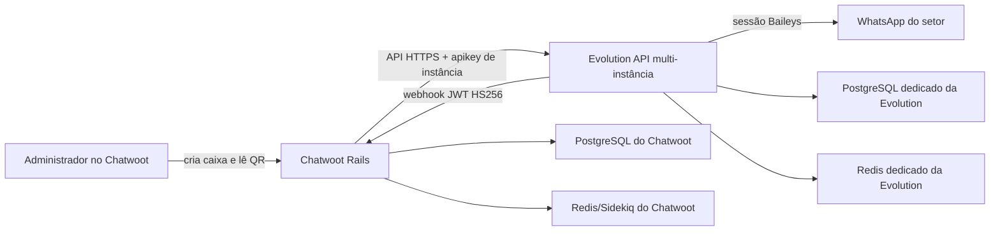

# WhatsApp nativo por QR Code com Evolution API

## Objetivo

Este documento é a fonte de verdade da integração nativa entre o Chatwoot e a
Evolution API. Para o usuário do Chatwoot, a criação ocorre integralmente em
`Nova caixa de entrada > WhatsApp > WhatsApp via QR Code`. A Evolution API é um
componente interno de transporte e não é exposta como painel, iframe ou fluxo
paralelo.

O contrato de endpoints e eventos desta implementação foi validado contra a
Evolution API `2.3.7`, commit
`cd800f2976e1e5b682fbf86a01ee4d85ae61f370`. Atualizar a Evolution exige nova
auditoria de compatibilidade antes do deploy.

Esta arquitetura complementa o provedor oficial Meta. Ela não converte números
Evolution em números oficiais, não oferece templates Meta e não altera as
regras dos canais `whatsapp_cloud`.

## Topologia



Invariantes:

- existe uma instalação Evolution multi-instância para todos os setores;
- PostgreSQL e Redis da Evolution são dedicados e não compartilham dados ou
  credenciais com o Chatwoot;
- a API Evolution é acessada somente pelo backend do Chatwoot;
- nenhum segredo, nome interno de instância ou URL administrativa é entregue
  ao navegador;
- cada caixa Evolution possui uma instância remota e uma credencial própria;
- a integração Chatwoot embutida na Evolution permanece desativada;
- `Channel::Whatsapp` continua sendo o canal nativo e usa `provider=evolution`;
- a caixa e o canal só são criados após a conexão real do QR Code.

## Fluxo de provisionamento

1. Um administrador informa o nome da caixa.
2. O Chatwoot cria um registro temporário
   `Whatsapp::EvolutionProvisioning`, com identificador público aleatório,
   token de instância e segredo de webhook.
3. O backend cria uma instância `WHATSAPP-BAILEYS` na Evolution e registra o
   callback assinado.
4. O navegador recebe somente o QR Code, estado, expiração e identificador
   público do provisionamento.
5. O Chatwoot consulta o estado em intervalos curtos enquanto aguarda o scan.
6. Após a Evolution comprovar `state=open`, o Chatwoot obtém o número conectado
   e cria, em uma única transação, `Channel::Whatsapp` e `Inbox`.
7. O fluxo segue para a seleção de agentes da caixa nativa.

Falha parcial após a criação remota aciona compensação de exclusão. Cancelar a
operação remove a instância remota. Provisionamentos sem conexão expiram em 15
minutos e são recolhidos pelo job horário.

## Persistência

`whatsapp_evolution_provisionings` mantém o vínculo operacional:

- conta e canal Chatwoot;
- identificador público opaco;
- nome interno da instância;
- token da instância e segredo do webhook criptografados com Active Record
  Encryption;
- estado, número conectado, perfil, expiração e último erro sanitizado.

`whatsapp_evolution_events` é o ledger de idempotência dos webhooks. A chave do
evento é um SHA-256 derivado do provisionamento, tipo e identificador estável da
mensagem ou evento. O payload bruto não é persistido nessa tabela.

O `provider_config` do canal guarda apenas
`evolution_provisioning_id`. Tokens, QR Code e segredos não entram no
`provider_config`.

## Contrato de segurança

- `EVOLUTION_API_KEY` é global e só pode criar, consultar ou excluir
  instâncias; fica no env privado do servidor.
- Cada operação de uma instância usa seu token aleatório criptografado.
- A Evolution assina cada webhook com JWT HS256 de vida máxima de 600 segundos.
- O Chatwoot exige `app=evolution`, `action=webhook`, `iat`, `exp` e o nome
  exato da instância.
- O endpoint público usa um identificador aleatório, responde sem detalhes a
  instâncias desconhecidas e rejeita assinatura inválida.
- QR remoto é aceito somente como PNG válido, com limite de tamanho, antes de
  ser entregue ao navegador.
- `apikey`, QR, pairing code, base64 e segredos são filtrados de logs e filas.
- TLS é obrigatório em produção, com verificação normal da cadeia e hostname.
- HTTP Basic Authentication no ingresso Evolution é opcional e, quando usada,
  exige usuário e senha juntos.

O callback público tem o formato:

```text
POST <FRONTEND_URL>/webhooks/evolution/<public_id>
```

## Mensagens

Eventos aceitos:

- `QRCODE_UPDATED`;
- `CONNECTION_UPDATE`;
- `MESSAGES_UPSERT`;
- `MESSAGES_UPDATE`;
- `SEND_MESSAGE`.

A versão inicial normaliza texto, imagem, vídeo, áudio, documento, sticker e
localização em conversas individuais. Mídia é obtida sob demanda pelo backend.
Grupos, broadcasts, newsletters e tipos desconhecidos são ignorados de forma
explícita; nunca são convertidos em texto inventado.

Confirmações da Evolution são mapeadas para `sent`, `delivered`, `read` ou
`failed`. Ecos de saída passam pelo pipeline existente do Chatwoot e o
identificador remoto é registrado em `Message#source_id`.

## Capacidades do provedor

| Capacidade                 | Meta Cloud          | Evolution                   |
| -------------------------- | ------------------- | --------------------------- |
| Sessão por QR Code         | não                 | sim                         |
| Templates oficiais Meta    | sim                 | não                         |
| Janela oficial de 24 horas | sim                 | não aplicada pelo provedor  |
| WhatsApp Calling API       | conforme Meta       | não                         |
| Conversas individuais      | sim                 | sim                         |
| Grupos/broadcast           | fora deste contrato | ignorados na versão inicial |

As capacidades são consultadas no serviço do provedor. A lógica Evolution não
deve ser acrescentada como exceção dispersa em componentes Meta.

## Fronteiras de manutenção

- API, autenticação e TLS:
  `app/services/whatsapp/evolution/api_client.rb` e `configuration.rb`;
- ciclo de vida:
  `provisioning_service.rb`, `connection_sync_service.rb`,
  `finalize_provisioning_service.rb` e `teardown_service.rb`;
- webhook:
  `app/controllers/webhooks/evolution_controller.rb`,
  `webhook_authenticator.rb`, `event_key.rb` e `webhook_processor.rb`;
- mensagens:
  `message_normalizer.rb`, `incoming_message_service.rb` e
  `providers/evolution_service.rb`;
- interface:
  `EvolutionWhatsapp.vue`;
- banco:
  `whatsapp_evolution_provisionings` e `whatsapp_evolution_events`.

Qualquer alteração no schema, eventos, endpoints, autenticação, segredo,
capacidade do provedor ou ciclo de vida deve atualizar este documento e o
runbook operacional no mesmo change set.
