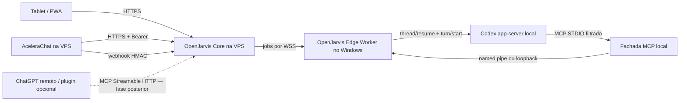

# Runbook de release — AceleraChat e OpenJarvis na VPS

Status: `HANDOFF / NÃO EXECUTADO`

Data de referência: 18 de agosto de 2026

## 1. Objetivo e autoridade

Este runbook define a preparação, implantação, ativação, validação e reversão da
integração nativa AceleraChat/OpenJarvis. Ele não autoriza o deploy por si só.

O operador deve interromper a execução se qualquer SHA, digest, backup,
credencial, caixa autorizada, domínio ou destino SSH divergir deste documento sem
uma decisão registrada.

Limites obrigatórios:

- atuar somente na VPS AceleraChat autorizada, `216.22.27.48`;
- não acessar nem modificar outras VPSs;
- não substituir, reinstalar ou reconfigurar globalmente o ICP/OpenResty;
- contatar o suporte ICP somente se for necessário criar ou trocar uma senha
  SSH; o uso do acesso SSH existente para a implantação autorizada não exige
  ticket adicional;
- não executar envio real de WhatsApp, Instagram ou e-mail durante o deploy;
- não usar Cloudflare Quick Tunnel em produção;
- não expor o Codex app-server, terminal ou filesystem local à internet;
- não imprimir segredos em terminal, CI, logs, relatórios ou mensagens;
- não reativar os conectores Gmail/IMAP ou Baileys como fallback implícito;
- manter `ACELERA_CONTROL_ENABLED=false`;
- fazer um único push/release depois dos gates locais, economizando GitHub
  Actions.

## 2. Rastreabilidade de entrada

### AceleraChat

- Repositório: `D:\dev\workspaces\centraldeatendimentoCHAT\server`.
- Branch preparada: `feat/openjarvis-native-integration`.
- SHA-base de compatibilidade: `128d00a1743e198eb370f55fbaf7bffe7a2b01f1`.
- SHA da implementação: `23487c8e7c92ae40d884105ca450809cde118598`.
- SHA do relatório/handoff antes destes runbooks:
  `612244e1e9e2e2edb88e1bbd5ffeab071a7b9f43`.
- SHA da primeira versão dos runbooks:
  `b0ca12a706f23c371cb39e98f8367ecd18793404`.
- Contrato: `2026-08-18.2`.
- Schema de webhook: `1.0`.
- Rollback lógico documentado: imagem correspondente ao SHA
  `128d00a1743e198eb370f55fbaf7bffe7a2b01f1`, sujeito à confirmação do ativo
  real no preflight.

O SHA a implantar deve ser o HEAD final, limpo, depois da revisão destes
documentos. O operador deve registrar também o digest imutável da imagem. Tags
mutáveis como `latest` não são aceitas.

### OpenJarvis

Estado observado antes deste handoff:

- Repositório: `D:\dev\workspaces\openjarvis`.
- Branch de trabalho: `codex/acelerachat-native-adapter`.
- Base registrada: `ec5e22e360943eb77560be3b9e5ea8ab7300b5eb`.
- Alterações do adaptador AceleraChat ainda não estavam commitadas.
- O agente OpenJarvis deve produzir um SHA final limpo, testes e relatório antes
  de qualquer instalação na VPS.

Não instalar o OpenJarvis a partir de um working tree sujo, arquivo compactado
manual ou diretório `node_modules` local.

## 3. Arquitetura aprovada

Responsabilidades:

| Componente | Responsabilidade | Não deve fazer |
| --- | --- | --- |
| AceleraChat | Autoridade sobre contatos, conversas, caixas, WhatsApp, Instagram e e-mail de atendimento | Expor shell, credenciais de provedor ou recursos fora da allowlist |
| OpenJarvis Core | Autoridade única de sessões, ações, aprovações, jobs, catálogo, timeline, webhook e coordenação dos Edge Workers | Afirmar que um worker offline está disponível ou criar outro orquestrador local |
| Edge Worker | Serviço Windows persistente, conexão de saída e execução local autorizada via Codex app-server | Guardar comando aprovado para executar quando o computador voltar ou publicar a porta 8131 |
| MCP local | Fachada STDIO fina entre Codex e Agent Core/Edge já ativos | Iniciar/controlar o Edge Worker, usar `ToolExecutor` legado ou delegar para o próprio Codex |
| Codex app-server | Executar e retomar tarefas Codex locais | Ser publicado no OpenResty ou internet |

O OpenJarvis Core da VPS é a única autoridade para sessões, ações, aprovações,
jobs, catálogo e histórico operacional. O Edge Worker é apenas executor de
capacidades dependentes do computador. Não pode existir um segundo Agent Core
independente no Windows.

A documentação oficial do Codex reconhece MCP local por STDIO e remoto por
Streamable HTTP com Bearer ou OAuth:
`https://learn.chatgpt.com/docs/extend/mcp?surface=cli`.

## 4. Endereços e superfícies

### Existentes

- AceleraChat público: `https://atendimento.meugerenciador.pro`.
- API OpenJarvis no AceleraChat:
  `https://atendimento.meugerenciador.pro/api/v1/openjarvis`.
- VPS: `216.22.27.48`, SSH `22`, usuário administrativo `root`.
- Painel: `https://vps10054.panel.icontainer.cloud:2090/admin`.

### Planejados

- Host público OpenJarvis: `openjarvis.meugerenciador.pro`.
- PWA autenticada: `https://openjarvis.meugerenciador.pro/jarvis`.
- Health mínimo: `GET https://openjarvis.meugerenciador.pro/healthz`.
- Agent Core: `https://openjarvis.meugerenciador.pro/v1/jarvis/agent/*`.
- Eventos Agent Core: `GET https://openjarvis.meugerenciador.pro/v1/jarvis/agent/events`.
- Gemini Live status/token/eventos:
  `/v1/jarvis/live/status`, `/v1/jarvis/live/token` e
  `/v1/jarvis/live/events`.
- MCP remoto opcional e posterior:
  `https://openjarvis.meugerenciador.pro/mcp`.
- Edge Worker: `wss://openjarvis.meugerenciador.pro/edge`.
- Callback AceleraChat:
  `https://openjarvis.meugerenciador.pro/v1/jarvis/agent/providers/acelerachat/webhooks`.

Nenhum desses endereços planejados deve ser anunciado como ativo antes de DNS,
TLS, autenticação e smoke real.

## 5. Pré-requisitos bloqueadores

### OpenJarvis

- working tree limpo e SHA final registrado;
- Edge Worker WSS implementado e testado;
- catálogo canônico conectado ao MCP local;
- PWA `/jarvis`, autenticação, Agent Core, eventos e token efêmero Gemini
  preparados para execução na VPS;
- imagem/artefato reproduzível para o Core da VPS;
- manifesto de variáveis sem valores secretos;
- migração de persistência versionada, quando necessária;
- testes unitários, contratuais, reconexão, duplicação e isolamento aprovados;
- rollback para `ec5e22e360943eb77560be3b9e5ea8ab7300b5eb` ou outro ativo
  anterior explicitamente registrado;
- confirmação de que `.manus-audit/`, `node_modules/` e lockfiles de origem
  incerta não entraram no release.

### Infraestrutura

- acesso SSH existente validado; suporte ICP só é necessário se houver criação
  ou troca de senha SSH;
- A record de `openjarvis.meugerenciador.pro` preparado para `216.22.27.48`;
- certificado TLS válido para o host;
- portas públicas limitadas a `80/443`; SSH conforme política atual;
- memória, disco e CPU compatíveis com mais um container;
- ausência de conflito com os serviços existentes;
- destino e política de backup definidos para o estado OpenJarvis;
- host key SSH validada pelo mecanismo de pinning já existente.

### AceleraChat

- branch final limpa e publicada em um único push;
- imagem construída pelo SHA completo e digest registrado;
- backup PostgreSQL novo e restaurável;
- estado de Redis, Sidekiq, Rails e OpenResty saudável;
- usuário de serviço ativo na conta `1`;
- allowlist explícita de caixas de e-mail e WhatsApp;
- endpoint HTTPS do receptor OpenJarvis ativo;
- Bearer e HMAC criados fora do Git;
- IDs das caixas obtidos do AceleraChat, nunca inferidos por nome.

## 6. Preflight somente leitura

Antes de qualquer mudança, registrar em um relatório datado:

1. SHA e imagem atualmente implantados no AceleraChat.
2. Digest da imagem ativa.
3. Nome e saúde de Rails, Sidekiq, PostgreSQL, Redis, Evolution e OpenResty.
4. Uso de CPU, memória, swap, disco e inodes.
5. Portas em escuta e redes Docker.
6. Configuração efetiva dos hosts AceleraChat, Evolution e AI Food Manager.
7. DNS atual de `openjarvis.meugerenciador.pro`.
8. Validade e cadeia dos certificados existentes.
9. Migrations OpenJarvis já aplicadas.
10. Existência do usuário de serviço e caixas candidatas, sem emitir tokens.
11. Fila Sidekiq e jobs com falha.
12. Último backup válido e teste de `pg_restore --list`.

O OpenResty existente ocupa `80/443` e deve ser estendido por configuração
isolada do novo host. Não iniciar outro proxy concorrente nessas portas.

## 7. Preparação do OpenJarvis Core

O agente OpenJarvis deve entregar antes da instalação:

- `Dockerfile` ou imagem imutável;
- arquivo Compose separado dos serviços AceleraChat;
- frontend/PWA `/jarvis` construído e servido pelo release da VPS;
- health check interno;
- processo sem privilégios;
- filesystem somente leitura onde possível;
- volume nomeado apenas para estado necessário;
- política `restart: unless-stopped` ou equivalente;
- limites de memória/CPU adequados à VPS de 6 GB;
- logs estruturados com rotação e redaction;
- configuração por arquivo privado montado, não por argumento de linha de
  comando;
- endpoint interno em loopback ou rede Docker privada;
- desligamento gracioso e recuperação após reinício.

Diretório operacional recomendado: `/opt/openjarvis`. O caminho final deve ser
registrado pelo agente; não reutilizar `/opt/central-atendimento` para estado ou
Compose do OpenJarvis.

O Core deve subir inicialmente desabilitado para mutações externas. Health,
catálogo, receiver HMAC, PWA, Agent Core, Edge e MCP local podem ser validados
sem enviar mensagens. MCP remoto é uma fase opcional e não bloqueia o Codex
local.

## 8. OpenResty, TLS e DNS

A mudança deve seguir a política do ICP e preservar a configuração atual.

Requisitos do virtual host `openjarvis.meugerenciador.pro`:

- TLS válido e redirecionamento HTTP para HTTPS;
- upstream privado do OpenJarvis Core;
- `/jarvis` e assets PWA sob autenticação da interface;
- `/v1/jarvis/agent/*` sob a mesma identidade da interface, preservando SSE;
- `/v1/jarvis/live/status`, `/v1/jarvis/live/token` e
  `/v1/jarvis/live/events` sob autenticação; a chave Gemini longa nunca chega ao
  navegador;
- `/healthz` com resposta mínima, sem versões internas ou segredos;
- `/mcp` desabilitado por padrão; quando a fase remota for autorizada, usar
  autenticação própria e suporte a streaming;
- `/edge` com upgrade WebSocket, timeout longo e autenticação do dispositivo;
- callback AceleraChat sem Basic Auth de navegador, porque usa HMAC no corpo;
- limite de corpo de `1 MiB` no callback;
- rate limit separado para MCP, Edge e webhook;
- `proxy_buffering off` apenas nas rotas de streaming;
- logs sem query strings, Authorization ou assinatura HMAC;
- demais caminhos negados por padrão;
- publicar apenas a PWA `/jarvis` e as APIs mínimas necessárias; painéis
  administrativos genéricos permanecem privados.

Para o Edge Worker não é necessário túnel reverso: o worker inicia WSS de saída
pela porta `443`. Cloudflare Quick Tunnel permanece proibido para produção.

## 9. Release AceleraChat

### 9.1 Backup

1. Criar backup PostgreSQL com timestamp e SHA atual.
2. Validar tamanho não zero e checksum.
3. Executar `pg_restore --list` no artefato.
4. Registrar caminho, checksum e retenção.
5. Preservar o apontamento da imagem anterior.

### 9.2 Migrations

O release contém cinco migrations da integração. O preflight deve determinar
quais estão pendentes:

1. `20260818120000_add_openjarvis_credentials_to_integration_hooks.rb`;
2. `20260818120100_create_openjarvis_api_requests.rb`;
3. `20260818120200_create_openjarvis_webhook_deliveries.rb`;
4. `20260818120300_harden_openjarvis_contract.rb`;
5. `20260818120400_add_openjarvis_contract_scopes.rb`.

Executar migrations uma única vez, pelo container da nova imagem. Não executar
`db:reset`, `db:schema:load` ou reversão física durante tráfego.

### 9.3 Troca de imagem

1. Confirmar que a imagem usa o SHA final completo.
2. Confirmar digest antes do pull/deploy.
3. Aplicar migrations.
4. Subir Rails e Sidekiq com a mesma imagem.
5. Aguardar health antes de trocar tráfego.
6. Verificar `/health`, login e uma leitura interna.
7. Não habilitar a conexão OpenJarvis ainda.

## 10. Configuração da integração

A configuração pertence à conta AceleraChat `1` e deve ser feita pela integração
nativa, não por SQL manual.

Valores necessários:

- usuário de serviço existente e ativo;
- caixas autorizadas por ID;
- URL HTTPS do callback;
- Bearer atual;
- segredo HMAC atual;
- segredo anterior vazio na primeira ativação;
- escopos mínimos requeridos pelo catálogo;
- retenções padrão do contrato.

O Bearer autentica OpenJarvis → AceleraChat. O HMAC autentica AceleraChat →
OpenJarvis. Eles são segredos distintos e não podem ser reutilizados no MCP ou no
Edge Worker.

Após criação, os valores completos podem aparecer uma única vez. Gravá-los no
arquivo privado indicado pelo manifesto e nunca em issue, commit ou relatório.

## 11. Ordem de ativação

1. OpenJarvis Core ativo, mas mutações desligadas.
2. DNS/TLS/OpenResty validados.
3. Callback responde aos testes de assinatura.
4. AceleraChat novo ativo e saudável.
5. Integração AceleraChat criada com allowlist mínima.
6. Credenciais OpenJarvis instaladas no arquivo privado.
7. Health e catálogo autenticados.
8. Backfill inicial exclusivamente de leitura.
9. Edge Worker conecta e anuncia capacidades reais.
10. MCP local lista somente ferramentas elegíveis.
11. PWA `/jarvis`, SSE e token efêmero Gemini são validados.
12. MCP remoto só é testado se sua fase opcional foi explicitamente incluída.
13. Janela de rollback permanece aberta até todos os smokes terminarem.

## 12. Smoke controlado sem mutação

### AceleraChat

- chamada sem Bearer retorna `401` com envelope público;
- `/catalog` retorna exatamente 23 operações;
- `/openapi` publica contrato `2026-08-18.2`;
- `/health` retorna release e status coerentes;
- `/diagnostics` não contém segredo, stack trace ou PII;
- `/inboxes` retorna somente allowlist;
- health por caixa diferencia configurado de conectado;
- contato, conversa e mensagem podem ser consultados por cursor;
- cursor adulterado é rejeitado;
- backfill pagina com `has_more` e `next_cursor`;
- integração de teste gera evento assinado sem disparar canal real;
- duplicata de webhook não duplica estado;
- logs não contêm Authorization, HMAC ou conteúdo sensível.

### OpenJarvis Core

- health interno e público mínimos;
- catálogo anuncia apenas capacidades disponíveis;
- receptor rejeita assinatura, timestamp e payload inválidos;
- payload acima de `1 MiB` retorna `413` estável;
- retry distingue falha temporária de permanente;
- backfill reconcilia evento perdido;
- reinício preserva ledger e não repete mutação;
- serviço não possui acesso a sockets/volumes AceleraChat desnecessários.

### Edge Worker e Codex

- worker abre somente conexão de saída;
- registro, heartbeat e reconexão funcionam;
- job sintético de leitura é oferecido somente com worker online;
- tentativa de delegação com worker offline termina imediatamente em
  `DEVICE_OFFLINE` e exige nova proposta/aprovação quando o dispositivo voltar;
- reconexão recupera apenas job já aceito/iniciado e entrega resultado já
  concluído, sem executar comando antigo ocultamente;
- job duplicado não executa duas vezes;
- worker offline aparece como indisponível;
- porta `8131` continua ligada apenas a loopback;
- MCP STDIO inicializa e lista ferramentas;
- fechar/reiniciar o Codex ou sua fachada MCP não encerra o serviço Edge;
- `tools/call` atravessa o Agent Core canônico e nunca o `ToolExecutor` legado;
- MCP do Codex não inclui `codex_delegate_task` nem ferramentas `codex.*`;
- nenhuma ferramenta mutável executa sem aprovação.

### PWA e acesso remoto

- `/jarvis` carrega em desktop, tablet e celular;
- autenticação da interface protege HTML, APIs e streams;
- sessão, ação, aprovação, job e timeline vêm do mesmo Core da VPS;
- SSE conecta, reconcilia e retoma sem duplicar eventos;
- token Gemini é curto, de uso único e não revela a chave longa;
- worker offline é apresentado como indisponível;
- nenhuma UI oferece execução automática posterior de comando aprovado.

## 13. Primeiro smoke mutável

Este runbook não autoriza mutação. Depois do aceite somente leitura, obter uma
autorização separada contendo:

- canal;
- caixa;
- destinatário de teste controlado;
- texto exato;
- horário;
- responsável por observar o recebimento.

Executar uma única mutação idempotente. Registrar `action_id`,
`Idempotency-Key`, mensagem, webhook terminal e resultado final. Não testar
campanha, broadcast ou múltiplos destinatários.

## 14. Observabilidade e retenção

Registrar sem conteúdo sensível:

- SHA e digest de cada serviço;
- estado dos workers;
- latência e status HTTP;
- `event_id`, `job_id`, `action_id` e sequência;
- tentativas e classificação de retry;
- aprovações e identidade do aprovador;
- motivo de indisponibilidade de provider;
- uso de recursos da VPS.

Retenções do contrato AceleraChat:

- idempotência: 30 dias;
- entregas de webhook: 30 dias;
- corpo do webhook não persiste no ledger;
- credencial anterior expira após sobreposição de 24 horas.

## 15. Rollback

### OpenJarvis

1. Desabilitar novas ofertas de jobs.
2. Aguardar ou cancelar jobs em estado não terminal.
3. Desativar a integração no AceleraChat para parar novos webhooks.
4. Remover o virtual host do tráfego somente conforme procedimento ICP.
5. Restaurar imagem/Compose anterior registrado.
6. Preservar ledgers para investigação; não apagar volumes automaticamente.
7. Confirmar que AceleraChat continua funcionando sem OpenJarvis.

### AceleraChat

1. Restaurar a imagem anterior confirmada no preflight.
2. Manter as tabelas aditivas inativas por padrão.
3. Validar Rails, Sidekiq, login, conversas e canais.
4. Não executar `db:migrate:down` com tráfego.

Somente se houver necessidade comprovada de reversão física, backup validado e
nenhum tráfego OpenJarvis:

1. `rails db:migrate:down VERSION=20260818120400`;
2. `rails db:migrate:down VERSION=20260818120300`.

As migrations anteriores só podem ser revertidas após auditoria de dependências.

## 16. Evidência final obrigatória

O relatório pós-deploy deve conter:

- ticket ICP, somente se houve criação ou troca de senha SSH;
- data e responsáveis;
- branch e SHA AceleraChat;
- digest AceleraChat;
- branch e SHA OpenJarvis;
- digest OpenJarvis;
- imagem anterior de cada serviço;
- backup e checksum;
- migrations aplicadas;
- DNS e certificado;
- configuração OpenResty alterada;
- IDs das caixas autorizadas, sem segredos;
- testes e smokes com resultado;
- captura de portas e containers;
- confirmação de zero envios reais ou descrição da mutação autorizada;
- decisão de manter ou executar rollback.

## 17. Fontes canônicas

- `docs/integrations/openjarvis-acelerachat-contract.md`;
- `docs/integrations/openjarvis-openapi.yaml`;
- `docs/integrations/openjarvis-acelerachat-implementation-report.md`;
- `docs/integrations/openjarvis-edge-worker-mcp-handoff.md`;
- manifesto privado descrito no fim do handoff.

Arquivos antigos em `credenciais/releases` são evidência histórica. Scripts que
fixam o SHA `128d00a...` ou o rollback `8e34f761...` não devem ser executados no
novo release sem atualização, revisão e teste.
